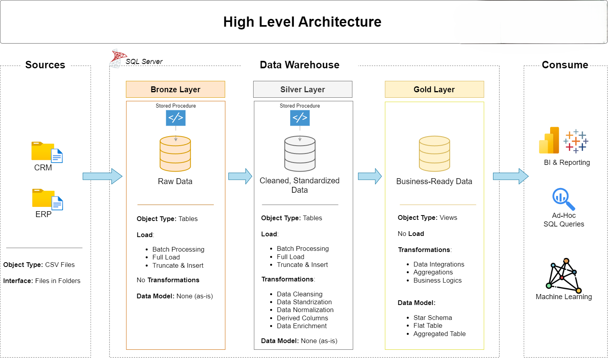

# Data Warehouse and Analytics Project

Welcome to the **Data Warehouse and Analytics Project** repository!.
This project demonstrates a comprehensive data warehousing and analytics solution, from building a data warehouse to generating actionable insights. Designed as a portfolio project highlights Industry practices in data engineering and analytics.

---

# Project Objective
To build a scalable and structured SQL-based data warehouse system capabale of handling raw data and transform it into business-ready insights.

# Data Architecture

The data architecture for this project follows Medallion Architecture **Bronze, Silver and Gold** layers:



- 1. **Bronze Layer**: Stores raw data as-is from the source systems.
   Data is ingested from CSV Files into SQL Server Database.
- 2. **Silver Layer**: This layer includes data cleansing,standardization, and normalization processes to prepare data for analysis.
- 3. **Gold Layer**: Houses business ready data modeled into a star schema required for reporting and analytics.

---

## Project Overview
This Project involves: 

- **Data Architecture**: Designing a Modern Data Warehouse Using Medallion Architecture **Bronze, Silver, and Gold** layers.
- **ETL Pipelines**: Extracting, transforming, and loading data from source systems into the warehouse.
- **Data Modelling**: Developing fact and dimension tables optimized for analytical queries.
- **Analytical & Reporting**: Creating SQL-based reports and Dashboards for actionable insights.

---

## Project Requirements

### Building the Data Warehouse (Data Engineering)

### Objective
Develop a modern data Warehouse using SQL Server to consolidate sales data, enabling analytical reporting and informed decision-making.

### Specifications
- **Data Sources**: Import Data from two source systems (ERP and CRM) provided as CSV files.
- **Data Quality**: Cleanse and resolve data quality issues prior to analysis.
- **Integration**: Combine both sources into a single, user-friendly data model designed for analytical queries.
- **Scope**: Focus on the latest dataset only; historization of data is not required.
- **Documentation**: provide clear documentation of the data model to support both buisness stakeholders and analytics teams.

 ---

  ### BI: Analytics & Reporting (Data Analytics)

  #### Objective
  Develop SQL-based analytics to deliver detailed insights into:
  - **Customer Behaviour**
  - **Product Performance**
  - **Sales Trends**

    These Insights empower stakeholders with key business matrics, enabling strategic, decision_making.

 ---

## Project Structure

```
data-warehouse-project/
│
├── datasets/                           # Raw datasets used for the project (ERP and CRM data)
│
├── docs/                               # Project documentation and architecture details
│   ├── etl.drawio                      # Draw.io file showing different techniques and methods of ETL
│   ├── data_architecture.drawio        # Project architecture diagram
│   ├── data_catalog.md                 # Dataset catalog with field descriptions and metadata
│   ├── data_flow.drawio                # Data flow diagram
│   ├── data_models.drawio              # Data models (star schema)
│   └── naming-conventions.md           # Naming guidelines for tables, columns, and files
│
├── scripts/                            # SQL scripts for ETL and transformations
│   ├── bronze/                         # Raw data extraction and loading
│   ├── silver/                         # Data cleaning and transformation
│   └── gold/                           # Analytical model creation
│
├── tests/                              # Test scripts and data quality checks
│
├── README.md                           # Project overview and instructions
├── LICENSE                             # Repository license information
└── .gitignore                          # Files and directories ignored by Git
```

 ---

## Technologies Used

  - **SQL**
  - **Data Warehousing Concepts**
  - **ETL Process**
  - **GitHub**

    ---
 
## ETL Process

   - 1. Load raw CSV files into Bronze Tables.
   - 2. Clean and transform data in Silver layer.
   - 3. Prepare analytical tables for reporting.
   - 4. Implement stored procedures for automation.

---

## Key Concepts Implemented

  - **Data Modelling**
  - **Data Cleaning**
  - **Stored Procedure**
  - **Aggregations**
  - **Joins & Subqueries**
  - **CTE**
  - **Window Functions**

  ---

 ## Licence

   This project is licensed under the [MLT License](LICENSE). You are free to use, modify, and share this project with proper attribution.

 ## About Us

 Hi there! I'm **Arti Singh**, also known as **ArtiSinghDA**. I'm an **Aspiring Data Analyst** with a strong academic bacground in **Statistics and Research**.
 I'm actively learning and improving every day.
 Open to entry-level Data Analyst Opportunities.

   


    
